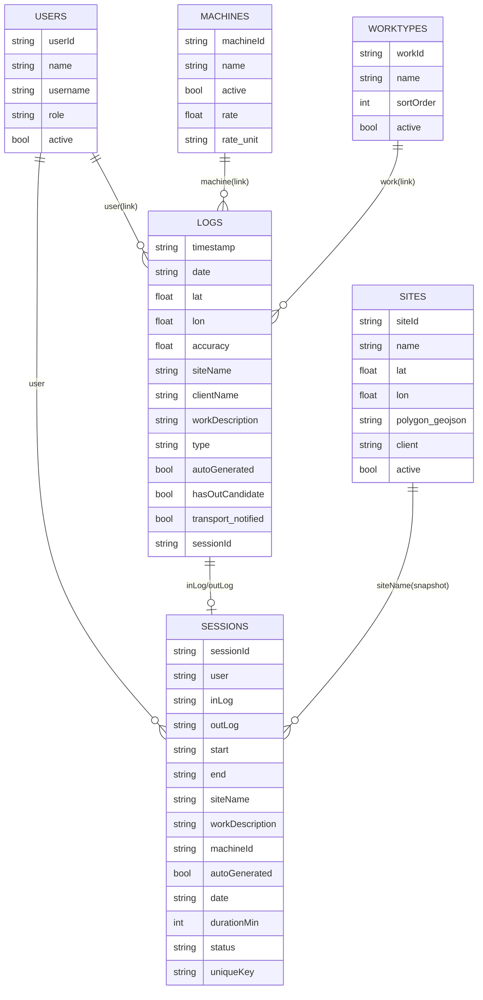
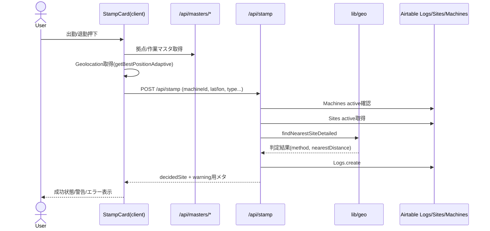
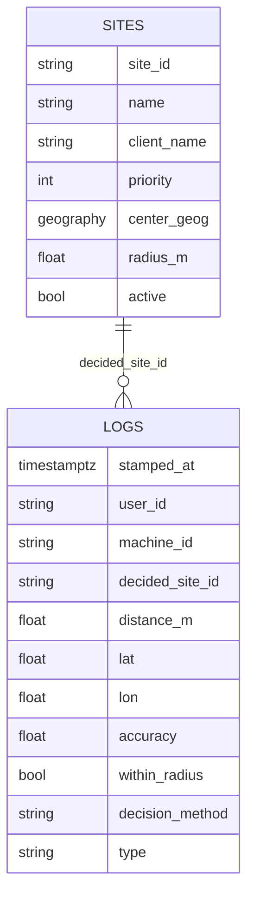

# NFC日報システム 基本設計書（AS-IS / TO-BE叩き台）

- 作成日: 2026-02-15
- 対象リポジトリ: `ai-nippo`
- 目的: 現行実装（AS-IS）をコード根拠ベースで再構築し、次期改善方針（TO-BE）を整理する
- 注意: 本書は**挙動変更なし**のドキュメント化。TO-BEは「提案（未実装）」である。

## 更新履歴

- 2026-02-15: 初版（AS-IS再構築 + TO-BE叩き台）
- 2026-02-15: 追補（制約明文化、Airtable実データnullable追記、Logs/Sessions実フィールド追記）

---

## 目次

1. [A. 概要](#a-概要)
2. [B. システムアーキテクチャ（AS-IS）](#b-システムアーキテクチャas-is)
3. [C. ディレクトリ / モジュールマップ](#c-ディレクトリ--モジュールマップ)
4. [D. ドメインモデル（AS-IS）](#d-ドメインモデルas-is)
5. [E. 画面 / UI設計（AS-IS）](#e-画面--ui設計as-is)
6. [F. API設計（AS-IS）](#f-api設計as-is)
7. [G. 打刻フロー（AS-IS）](#g-打刻フローas-is)
8. [H. 位置情報 / 現場判定（AS-IS）](#h-位置情報--現場判定as-is)
9. [I. データ整合性 / セキュリティ / プライバシー（AS-IS）](#i-データ整合性--セキュリティ--プライバシーas-is)
10. [J. 運用（AS-IS）](#j-運用as-is)
11. [K. テスト（AS-IS）](#k-テストas-is)
12. [L. TO-BE Draft（Proposed / Not Yet Implemented）](#l-to-be-draftproposed--not-yet-implemented)

---

## A. 概要

### A-1. プロダクト目的

- NFC起点で出退勤（IN/OUT）を打刻し、日報・月次レポート・勤怠集計を提供する。
- 現場・機械・作業内容の組み合わせでログを蓄積し、CSV/Excel出力と可視化を行う。

### A-2. 想定ユーザー / ロール

- 一般ユーザー: 打刻（NFC）、自身の実績確認。
- 管理側ユーザー: レポート閲覧・出力。
- ロール情報は `Users.role` をセッションに保持（`admin` / `user`）。
- AS-ISでは、ページ保護（middleware）とAPIの `auth()` 適用が混在し、保護粒度は一様ではない。

### A-3. コア価値

- モバイル現場での低操作負担打刻（位置情報＋機械識別）。
- 打刻ログからの一貫した集計（カレンダー・勤怠・工数レポート）。

### A-4. 非ゴール（現行）

- DBをNeon/Postgresへ移行する実装は未対応（現行はAirtable中心）。
- 位置判定のDBネイティブ空間計算（PostGIS）や厳密監査列の整備は未実装。

### A-5. 用語（本書内）

- Logs: 打刻の一次記録（IN/OUT、座標、作業内容など）を保持するイベントテーブル。
- Sessions: LogsをIN/OUTでペアリングして作る業務区間の論理単位（実体テーブル/派生データ双方を含む呼称）。
- 現場判定: 打刻座標から対象現場を決定する処理（AS-ISはpolygon優先→最近傍）。
- 除雪: 既存業務文脈の用語。本書TO-BEでは**特別ロジック追加なし**を前提とする。

---

## B. システムアーキテクチャ（AS-IS）

### B-1. 技術スタック

- Frontend: Next.js App Router + TypeScript + React Client/Server Components
- Backend: Route Handlers (`app/api/**/route.ts`)
- Auth: NextAuth Credentials（JWTセッション）
- Data Source: Airtable（SDKおよびREST fetchの併用）
- Hosting/Deploy: GitHub → Vercel 想定
- Runtime: Node.js runtime指定あり（特にAPI一部）

### B-2. 構成図（AS-IS）

```mermaid
flowchart LR
  U[利用者] -->|Browser| N[Next.js App Router]
  N -->|NextAuth Credentials| A1[/api/auth/[...nextauth]/]
  N -->|打刻UI| NFC[/nfc]
  NFC -->|POST| STAMP[/api/stamp]
  NFC -->|GET| M1[/api/masters/sites]
  NFC -->|GET| M2[/api/masters/work-types]
  STAMP --> GEO[lib/geo.ts<br/>polygon→nearest判定]
  STAMP --> AT[(Airtable Logs/Sites/Machines/Users)]
  R[レポートUI] --> API[/api/reports/*, /api/report/work/attendance/*]
  API --> AT
```

### B-3. 補足

- `app/api/stamp/route.ts` は `runtime='nodejs'` を明示。
- `middleware.ts` は `/reports`, `/dashboard`, `/report` を認証保護し、`/login` を除外。
- `/nfc` は middleware matcher外だが、ページ側で `auth()` により未ログイン時リダイレクト。

### B-4. 実行環境/制約（AS-IS）

- GeolocationはHTTPSのsecure contextを前提（HTTPでは取得不可）。
- Airtableアクセスはサーバー側環境変数（`AIRTABLE_API_KEY` など）経由。
- APIはNode runtime前提で設計されており、Edge runtimeは想定しない。

---

## C. ディレクトリ / モジュールマップ

- `app/`
  - 画面ルート（`/(auth)`, `/(protected)`, `/reports` など）
  - APIルート（`app/api/**/route.ts`）
- `components/`
  - `StampCard.tsx`: 打刻UI中核、Geolocation取得、警告表示、API呼び出し
  - `LoginForm.tsx`: Credentialsログイン
- `lib/`
  - `auth.ts`: NextAuth設定
  - `airtable.ts`: Airtable SDKテーブルアクセス
  - `geo.ts`: ポリゴン内判定＋最近傍判定
  - `airtable/*`, `report/*`, `services/*`: 集計・検索・変換
- `src/lib/airtable/`
  - Airtable RESTクライアント（再試行付き）
- `types/`
  - Airtableテーブル項目のTS型
- `tests/`
  - geo、stamp、calendar、airtable retry、a11y、break policy 等
- `docs/`
  - 監査・調査・セキュリティ関連ドキュメント

---

## D. ドメインモデル（AS-IS）

### D-1. 主要エンティティ

- Users
  - `userId`, `name`, `username`, `email`, `phone`, `password`, `role`, `active`, `excludeBreakDeduction`
  - 備考: 実データでは連絡先・認証関連列が存在し、コード定義フラグ以外の運用列が追加され得る。
- Machines
  - `machineId`（実装上は`machineid`表記も混在）, `name`, `active`, `rate`, `rate_unit`
- Sites
  - `siteId`, `name`, `lat`, `lon`, `polygon_geojson`, `client`, `active`
  - **重要**: Airtable実レコードとして `lat` / `lon` / `polygon_geojson` がNULLの行が存在し得る。
- WorkTypes
  - `workId`, `name`, `sortOrder`, `active`
- Logs
  - `timestamp`, `date`, `user[]`, `machine[]`, `lat`, `lon`, `accuracy`, `siteName`, `clientName`, `workDescription`, `type(IN/OUT)`
  - 運用列: `autoGenerated`, `hasOutCandidate`, `transport_notified` など、補完/通知/監査用途の追加列を含み得る。
  - セッション連携列: `sessionId` / `sessionUniqueKey` / `inLogId` / `outLogId` 等のリンク・識別列を保持する運用があり得る。
- Sessions
  - `sessionId`, `user`, `inLog`, `outLog`, `start`, `end`, `siteName`, `workDescription`, `machineId`, `autoGenerated`, `date`, `durationMin`, `status`, `uniqueKey`

### D-2. 関連

- Logs.user → Users（Link to record）
- Logs.machine → Machines（Link to record）
- Logs.work → WorkTypes（Link to record / または名称保存を併用）
- Logs.siteName/clientName は打刻時にSites由来を文字列保存（参照冗長化）
- SessionsはLogsのIN/OUTペアリングで成立し、`inLog`/`outLog` 参照と `uniqueKey` により同一業務区間を識別する。

### D-3. ER図（AS-IS）



### D-3. 補足（スナップショット設計の監査特性）

- Logsは `siteName` / `clientName` を文字列スナップショットとして保持し、現場マスタの後日変更の影響を受けにくい。
- 一方で、`siteId` の外部キーを持たないため、マスタ統合・正規化監査では逆引き補正が必要になる。

### D-4. Airtableデータの性質（AS-IS運用上の注意）

- Airtableのcheckboxはエクスポート時に `1/0` や `true/false` が混在し得るため、取り込み時に正規化が必要。
- Sitesの `lat/lon` nullable行が存在するため、距離計算処理はNULL/非数値に対して堅牢化が必須。

---

## E. 画面 / UI設計（AS-IS）

### E-1. 主要画面

- `/login`
  - ID/パスワード入力、エラー表示、`callbackUrl` 対応
- `/nfc`
  - 機械ID解決（クエリ or 既定値 or fallback）
  - 当日最終ログから初期状態を `IN/OUT` 決定
  - `StampCard` で出勤/退勤、位置取得、警告・エラーハンドリング
- `/dashboard`
  - 月次カレンダー、日次詳細ドロワー
- `/reports`, `/reports/attendance`, `/reports/sites`
  - 検索、一覧、CSV/Excel、印刷

### E-2. UI状態

- loading: API取得中/打刻送信中に状態表示
- error: API失敗、打刻失敗、ログイン失敗
- location permission denied: 専用ダイアログと再試行導線
- offline/通信失敗相当: fetch失敗時に汎用メッセージ
- 完了状態: OUT後に「本日の業務お疲れ様でした。」表示

---

## F. API設計（AS-IS）

> 主要レスポンスはJSON。Excel系はバイナリを返却。

### F-1. 認証/セッション

- `GET|POST /api/auth/[...nextauth]`
  - NextAuthハンドラ委譲

### F-2. 打刻

- `POST /api/stamp`
  - Auth必須（`auth()`）
  - Request: `machineId`, `workDescription`, `lat`, `lon`, `type`, 任意`accuracy`等
  - Validation: `validateStampRequest`
  - Side effect:
    - 機械存在/active確認
    - active site一覧取得
    - 現場判定（polygon内優先→最近傍）
    - Logsへ1件作成
  - Response:
    - `decidedSiteId`, `decidedSiteName`, `decision_method`, `nearest_distance_m`, `accuracy`
  - Error: `401 UNAUTHORIZED`, `400 INVALID_BODY/INVALID_MACHINE`, `500 INTERNAL_ERROR`
  - 注意（AS-IS既知事項）:
    - クライアントから `accuracy: null` が送られ得る一方、validator実装上は `number | undefined` 判定のため `INVALID_BODY` 化するケースがある（ログ監視対象）。

### F-3. マスタ

- `GET /api/masters/sites`
  - active sites返却
- `GET /api/masters/machines`
  - active machines返却（machineIdソート指定あり）
- `GET /api/masters/work-types`
  - active work types返却（sortOrderソート）

### F-4. カレンダー

- `GET /api/calendar/month`
  - Auth必須
  - `year`,`month`必須。対象月のログ集計
- `GET /api/calendar/day`
  - Auth必須
  - `date(YYYY-MM-DD)`必須。日次セッション詳細返却

### F-5. レポート（ユーザー/現場）

- `GET /api/reports`
  - `userName`必須
  - ユーザー名ベース一覧取得
- `GET /api/reports/search`
  - `year`,`month`必須
  - `sitename`,`username`,`machinename` 部分一致フィルタ
- `GET /api/reports/work`
  - `year`,`month`必須
  - user/site/machineで工数集計
- `GET /api/reports/sites`
  - Auth必須
  - `year`,`month`,`siteId`必須
- `GET /api/reports/export/excel`
  - Auth必須
  - user filter必須、個人レポートExcel返却
- `GET /api/reports/sites/export/excel`
  - Auth必須
  - `month`,`siteId`必須、現場別Excel返却

### F-6. 勤怠系

- `GET /api/report/work/attendance`
  - `month`必須、site/user/machine絞り込み
- `GET /api/report/work/attendance/day`
  - `date`必須、`user`必須
  - 日次計算（休憩控除ポリシー適用含む）
- `GET /api/report/work/attendance/export/excel`
  - Auth必須
  - 勤怠月次Excel返却

### F-7. 運用バッチ

- `GET /api/cron/close-open-sessions`
  - 日次で未クローズINを強制OUT補完
  - `dryRun`, `debug`, `date` クエリあり
  - Airtableへ作成/更新（スナップショット・書き戻し）

---

## G. 打刻フロー（AS-IS）



---

## H. 位置情報 / 現場判定（AS-IS）

### H-1. クライアント側

- `navigator.geolocation` + secure context必須。
- `getBestPositionAdaptive` で段階取得:
  1. `getOnce` で初回取得
  2. ポリゴン内 or 精度100m以内等を満たせば採用
  3. 満たさない場合 `watchPosition` で追加サンプリング（2s/8s）
  4. 失敗時は localStorageの前回位置（`smarepo:lastPosition`）をfallback
- 警告表示:
  - 位置情報の鮮度 >10秒
  - cache利用
  - サーバー返却accuracy >100m
  - nearest distance >1000m（「離れている可能性」警告）

### H-2. サーバー側最終判定

- `findNearestSiteDetailed(lat, lon, sites)`
  - active siteが0件: null
  - `polygon_geojson` を先に評価（`pointInGeometry`）し、含まれる最初のsiteを採用（method=`gps_polygon`, distance=0）
  - 該当なし時は全siteにハバーサイン距離を計算し最短を採用（method=`gps_nearest`）
- 拒否閾値（距離で打刻拒否）は実装なし。判定結果を返し、クライアント側で警告表示のみ。

補足（AS-ISのtie-breakとデータ品質）:

- polygon複数ヒット時はAirtable取得順（先勝ち）で決まる。
- 最近傍距離が同値の場合も先に走査されたsiteが採用される。
- Sitesの `lat/lon` NULLを含む場合、計算途中で `NaN/Infinity/null` に寄る余地があり、TO-BEではNULL処理を仕様として固定する必要がある。

### H-3. 永続化項目（ログ）

- 保存: `lat`, `lon`, `accuracy`, `siteName`, `clientName`, `workDescription`, `type`, `timestamp`, `date`, `user`, `machine`
- 未保存（現行）: `decidedSiteId`, `decision_method`, `nearest_distance_m` はレスポンス専用で、Logsには直接保存していない

### H-4. リスク（コード根拠ベース）

- 近接拠点（~1km）では最近傍の揺らぎで判定ぶれの可能性。
- polygonデータ品質差（parse失敗時は無視）が判定一貫性に影響。
- cache位置fallbackにより古い座標での打刻となる可能性。

### H-5. 既知の不具合/仕様ギャップ（AS-IS）

- `accuracy` はクライアント実装で `null` 送信があり得るが、validatorは `number | undefined` 前提であり整合ギャップがある。
- `accuracy` は警告表示には利用されるが、打刻受理/拒否の判定条件には使われていない。

---

## I. データ整合性 / セキュリティ / プライバシー（AS-IS）

### I-1. シークレット管理

- Airtableキー/BASE_IDは server-side `process.env` で参照。
- クライアント公開envは `NEXT_PUBLIC_DEFAULT_MACHINE_ID` のみ。
- NextAuth secretは `NEXTAUTH_SECRET`。未設定時のdev fallbackあり（本番ではエラー）。

### I-2. 入力検証

- `/api/stamp` は必須型検証（手書きバリデータ）。
- 複数APIで month/date/user 等のフォーマット・数値検証を実装。

### I-3. 認可

- API単位の `auth()` 保護は部分適用（全API一律ではない）。
- middlewareによるページ保護対象は `/reports`, `/dashboard`, `/report`。

### I-4. ログ方針

- サーバー側 `console`/`logger` で障害情報記録。
- 認証エラーログに secret長などメタ情報を出力する実装があるため、運用時はログアクセス統制が前提。

---

## J. 運用（AS-IS）

### J-1. 主な環境変数

- 認証: `NEXTAUTH_SECRET`
- Airtable接続: `AIRTABLE_API_KEY`, `AIRTABLE_BASE_ID`
- テーブル/フィールド上書き: `AIRTABLE_TABLE_LOGS`, `AIRTABLE_FIELD_*`
- 強制OUT制御: `FORCED_OUT_*`
- 打刻画面既定機械ID: `NEXT_PUBLIC_DEFAULT_MACHINE_ID`
- 集計ポリシー: `ENABLE_BREAK_POLICY`, `TIME_CALC_*`

### J-2. デプロイ

- Vercel運用前提。READMEに secret運用・再デプロイ手順のrunbook記載あり。

### J-3. 障害モードと利用者影響

- Airtable障害: マスタ取得失敗/打刻失敗/レポート失敗
- Geolocation拒否/失敗: 再試行ダイアログ表示
- 機械ID不整合: nfcページでエラー表示またはfallback機械へ誘導

---

## K. テスト（AS-IS）

- テスト基盤: `tests/*.mjs` を中心にユニット/統合寄りテストを配置
- 主な対象:
  - 打刻・位置判定（`tests/stamp.test.mjs`, `tests/geo.test.mjs`, `tests/location-error.test.mjs`）
  - カレンダーAPI（`tests/calendar/api.*.test.mjs`）
  - Airtable retry/スキーマ（`tests/lib/airtable.retry.test.mjs`, `tests/airtableSchema.test.mjs`）
  - 休憩控除・勤怠集計（`tests/lib/policies/*`, `tests/lib/report/work/attendance/*`）
  - a11y（キーボード・色）
- 未網羅領域（推定）:
  - 実Airtable接続を伴うE2E
  - ブラウザ実地の位置情報権限/端末依存挙動

---

## L. TO-BE Draft（Proposed / Not Yet Implemented）

> **提案段階（未実装）**。現行挙動は維持したまま、次期改善の意思決定材料として記載。

### L-1. 目標

- 位置判定品質を向上し、監査可能性・運用一貫性を高める。

### L-2. 判定ロジック方針（決定レベル）

1. **Postgres + PostGIS（geography）採用**
   - サイト座標と打刻座標をDBで距離計算（`ST_Distance` 相当）。
2. **ポリゴン判定を廃止**
   - `polygon_geojson` ロジックは判定から除外（AS-ISとの明確な差分）。
3. **拒否しきい値を設けない**
   - 現行同様、active siteが存在する限り必ず最近傍を返す。
4. **除雪（雪害関連）挙動は現状維持**
   - 特別ルール追加なし（既存業務ルール据え置き）。
5. **同距離時の安定tie-break導入**
   - `priority` → `site_id` などで決定順序を固定。
6. **監査列追加**
   - `distance_m`（判定時距離）をLogsへ保存し、判定根拠を追跡可能化。

#### L-2-a. TO-BEアーキテクチャ（位置判定）

```mermaid
flowchart LR
  UI[Next.js /nfc] --> API[/api/stamp]
  API --> PG[(Neon Postgres + PostGIS)]
  PG --> API
  API --> UI
```

- Neon接続環境変数（`DATABASE_URL` / `NEON_DATABASE_URL`）は**server-only**で管理し、クライアントへ露出しない。

#### L-2-b. 判定仕様（最近傍のみ・拒否しない）

- 判定は「nearest only」。拒否しきい値は持たない。
- `ORDER BY distance_m ASC NULLS LAST` を基本に、同値時は `priority DESC`, `site_id ASC` で安定tie-break。
- active siteがあっても有効座標を持つ行が0件なら `decidedSiteId = null` を返す（受理は行う）。

#### L-2-c. 参照SQL（仕様固定用）

```sql
WITH p AS (
  SELECT ST_SetSRID(ST_MakePoint($1, $2), 4326)::geography AS g
)
SELECT
  s.site_id,
  s.name,
  s.priority,
  CASE
    WHEN s.center_geog IS NULL THEN NULL
    ELSE ST_Distance(s.center_geog, p.g)
  END AS distance_m
FROM sites s
CROSS JOIN p
WHERE s.active = TRUE
ORDER BY distance_m ASC NULLS LAST, s.priority DESC, s.site_id ASC
LIMIT 1;
```

```sql
CREATE INDEX IF NOT EXISTS idx_sites_center_geog_gist
  ON sites USING GIST (center_geog);
```

#### L-2-d. radius_m の扱い

- `radius_m` は受理/拒否判定には使わない。
- `within_radius` を監査・警告表示用に計算保存する補助指標として扱う。

### L-3. TO-BE ER（位置判定関連の抜粋）



### L-4. 影響スコープ（将来変更対象、今回は未変更）

- 判定ロジック: `lib/geo.ts`（段階的置換または互換レイヤ）
- 打刻API: `app/api/stamp/route.ts`（判定呼び出し・保存列追加）
- 型定義: `types/index.ts`（ログ監査列）
- マスタ取得: `app/api/masters/sites/route.ts`（Postgres参照に切替時）
- データアクセス層: `lib/airtable.ts` / `src/lib/airtable/*` と並行し、Postgres adapter追加
- レポート系: `app/api/reports*`, `app/api/report/work/attendance*`（site参照軸の互換確認）

### L-5. 移行ガードレール

- フェーズ1: 判定をDB化してもUI/レスポンス契約は維持。
- フェーズ2: `distance_m` と `decided_site_id` の保存を開始し、監査可視化。
- フェーズ3: 既存Airtable依存を段階縮退（必要に応じてread互換期間を確保）。

### L-6. 品質ガードレール（TO-BEでの最低ライン）

- 常に最近傍を返す（有効座標が0件のときのみ `decidedSiteId=null`）。
- tie-breakは `distance_m` → `priority` → `site_id` で固定する。
- 監査列 `distance_m` / `decision_method` を保存し、`accuracy` は分析用途で保持（拒否判定には不使用）。
- DB接続情報（`DATABASE_URL` / `NEON_DATABASE_URL`）はserver-onlyを厳守する。

---

以上。
